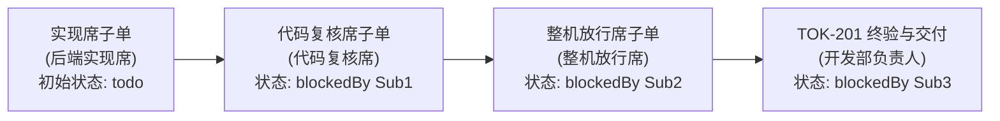

# 负责人裁定与派单（开发部负责人）

- **业务事项 ID**：TOK-184 Defect 2 ＋ Defect 3
- **来源 issue**：[TOK-199](/TOK/issues/TOK-199)（产品部负责人持有），执行单：[TOK-201](/TOK/issues/TOK-201)（开发部负责人持有）
- **日期**：2026-09-17
- **档位**：**中活**（规格已由上游 CEO 裁定定死，部门内不必另出规格单；走 执行 → 代码复核 → 整机放行 三道）
- **授权档**：**全权**。边界到「分支上的候选改动 ＋ 部门内代码复核报告 ＋ 整机放行报告」。
  🔴 **红线**：严禁部署（把修复装进正在跑的 Paperclip 实例、替换 `~/.paperclip/cli/current` 或重启服务属不可逆动作，另需董事会审批）；严禁 push 远端；严禁提 master。

---

## 一、H06 四要素核验（开发部入口门禁）

依据开发部负责人工作守则第 1 条，核查 H06 四要素：

| 要素 | 核查事实 | 结论 |
|---|---|---|
| **1. 已接受规格** | CEO 路由裁定（`交付/TOK-184/路由裁定.md`）与产品部线级拆解（TOK-199 / TOK-201 描述）已定死两项缺陷边界、因果链与验收点，规格自足 | ✅ 齐备 |
| **2. 设计包** | Defect 2：`syncBlockedByIssueIds` 底层护栏 ＋ `recovery/service.ts` 调用方过滤；Defect 3：三选一取舍选型与方案设计 | ✅ 齐备 |
| **3. 威胁模型** | 授权边界到分支候选；保留原有保护（子树已处于 live/waiting/already-reviewed 时陈旧 watchdog 仍被拒写）；未知改动不越界 | ✅ 齐备 |
| **4. 默认入口验收点** | 零特殊 flag、零临时脚本、相关测试套件全绿、skipped 为 0、反假绿禁令、变异测试要求 | ✅ 齐备 |

**入口门禁判定**：四要素齐全，准予进入部门内派单与执行流水线。

---

## 二、并发控制与文件边界决策

依据公司全员通用纪律五「两张单会不会写同一个文件？会 → 必须串行（blockedBy）；不会 → 可以并行」与执行纪律十二「严禁双向空等」：

1. **两单文件边界核定**：
   - [TOK-188](/TOK/issues/TOK-188) 唯一所有文件为 `server/src/services/recovery/successful-run-handoff.ts`（标题明确限制）；
   - 本单所有文件为 `server/src/services/task-watchdogs.ts`、`server/src/services/issues.ts`、`server/src/services/recovery/service.ts`（仅涉及 `openChildIssues` / `healthyOpenChildIssues` 过滤段）以及新建测试文件。
   - 两张单的正式责任文件集合**不存在交集**。
2. **在途状态与反死锁**：
   - TOK-188 当前处于等待 board 决策处置状态（`blockingTreeLive: false`，无活跃 run），若本单设置 `blockedBy = [TOK-188]`，将直接导致本单进入死锁空等，严重违反「严禁双向空等」红线。
   - 工作树中当前遗留的未提交修改（如 `service.ts:3824` 处的改动），实现席在分支构建时必须严格遵循隔离原则：开独立分支 `fix/tok-199-watchdog-self-block-and-mutation-scope`，使用 `git add <精确路径>` 仅提交本单文件，严禁使用 `git add -A` 或 `git add .`，严禁碰其他无关改动。
3. **调度决策**：
   - 本单实现席子单不挂 TOK-188 阻塞，初始状态为 `todo`，实现席被立即调度开工。

---

## 三、部门内派单流水线（三道串联）

本部门内部派发 3 张子单，串成严格的「实现 → 复核 → 放行」单向流水线，子单建在本部门项目「04·开发部」（`4ba5934f-220c-4fe4-b5ad-aff40e71d2aa`），指向分叉仓路径 `/home/yuanjian/dev/ANC`：

### 1. 实现席（后端实现席 `e5688583-b5ee-4366-8445-d219f4a23c3a`）
- **职责**：代码实现、插入点独立验证、单元测试与变异测试、候选 commit SHA 落地。
- **阻塞关系**：无（初始状态 `todo`，立即开跑）
- **允许碰的文件**：
  - `server/src/services/task-watchdogs.ts`
  - `server/src/services/issues.ts`
  - `server/src/services/recovery/service.ts`
  - `server/src/__tests__/<新建测试文件>`（如 `server/src/__tests__/watchdog-blocker-and-mutation-scope.test.ts`）
- **核心验收点**：
  - Defect 2 插入点独立验证（三态严格区分：不存在（穷尽）／未找到（非穷尽）／工具不可用）；
  - `syncBlockedByIssueIds` 底层护栏（任何 watchdog 单不得阻塞其监视的源单）；
  - `recovery/service.ts` 过滤 `originKind=task_watchdog`；
  - Defect 2 写入层拦截类形测试 ＋ 变异测试（删护栏测试必红，贴原文后还原） ＋ recovery 路径复现测试；
  - Defect 3 设计取舍选型明确记录（三选一），并落码；
  - Defect 3 漂移放行类形测试 ＋ 原有保护不废弃测试 ＋ 变异测试（回退测试必红，贴原文后还原）。

### 2. 代码复核席（代码复核席 `2e743ef8-9442-4578-8c0f-20b9f4a6564a`）
- **职责**：独立审查代码改动、架构一致性与变异测试证据。
- **阻塞关系**：`blockedBy = [实现席子单]`
- **只写文件**：`/home/yuanjian/dev/ANC/交付/TOK-199/代码复核.md`（严禁碰任何代码文件）。
- **核查清单**：
  - 类形判据覆盖（非实例形）；
  - 变异测试转红证据实查；
  - 三态措辞审查；
  - 架构与安全边界（原有防线未被废弃）；
  - 反假绿审查（无 hasattr、skipped=0、顶层无条件断言）。
- **结论输出**：明确给出 `无阻断项` 或 `有阻断项`。

### 3. 整机放行席（整机放行席 `5c3d3493-ec79-4383-b3f1-04622007479e`）
- **职责**：独立验证默认生产入口。
- **阻塞关系**：`blockedBy = [代码复核席子单]`
- **只写文件**：`/home/yuanjian/dev/ANC/交付/TOK-199/整机放行.md`（严禁碰任何代码文件）。
- **步骤 0 门禁**：复核结论若为 `有阻断项`，严禁开跑，直接拒放行；为 `无阻断项` 才执行整机放行测试。
- **放行断言**：零 flag、零临时脚本，运行默认生产入口回归测试，断言 skipped 为 0，给出回滚候选，明确给出 `可放行` 或 `拒绝放行`。

---

## 四、开发部负责人处置

- 本单 [TOK-201](/TOK/issues/TOK-201) 在完成三张子单派发后，设置 `blockedByIssueIds = [整机放行席子单]`，状态更新为 `blocked`。
- 整机放行席完成并标 `done` 后，平台将自动唤醒开发部负责人。届时核三件事（复核无阻断项 / 整机放行有默认入口断言结果 / 有回滚候选），合格后向产品部交付并置 `done`。
